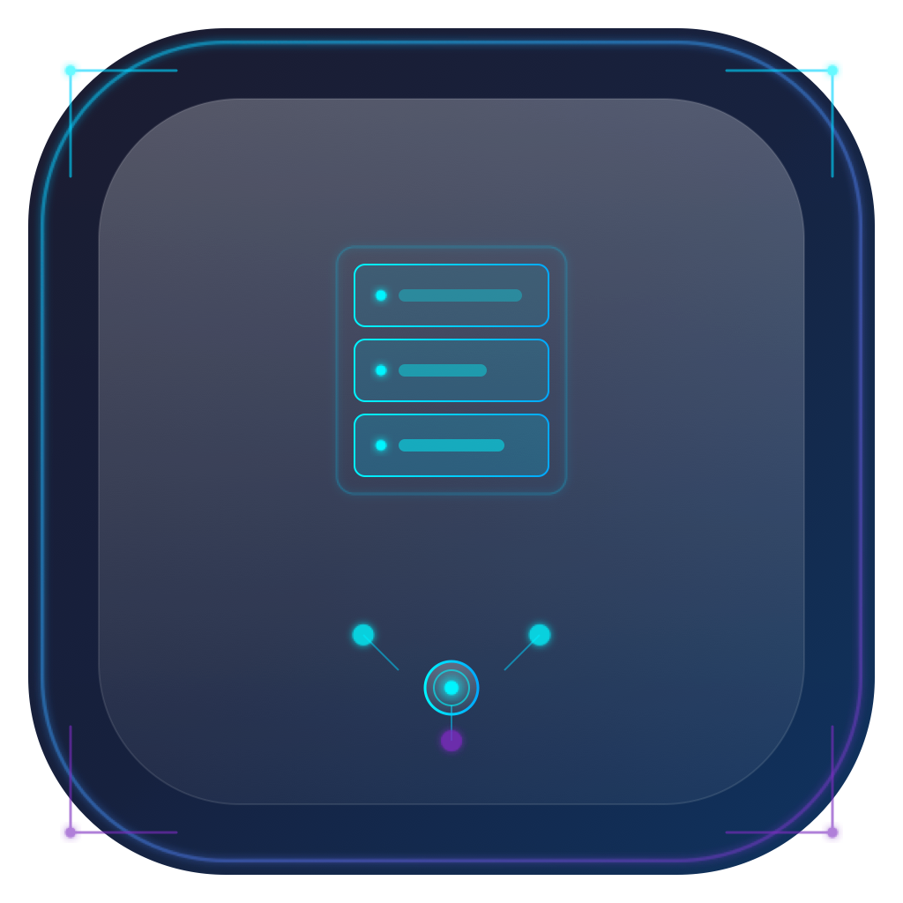

# Virtual Host Manager

<p align="center">
  
</p>

<p align="center">
  <b>A futuristic, glassmorphism-styled desktop application for managing virtual hosts on macOS</b>
</p>

<p align="center">
  <a href="#features">Features</a> •
  <a href="#installation">Installation</a> •
  <a href="#usage">Usage</a> •
  <a href="#development">Development</a> •
  <a href="#contributing">Contributing</a> •
  <a href="#license">License</a>
</p>

<p align="center">
  
  
  
  
  
</p>

---

## Features

- 🚀 **Futuristic Spaceship Console UI** — Glassmorphism design with stunning animated effects powered by Framer Motion
- 📝 **Hosts File Management** — Intuitive interface for adding, editing, and removing entries in `/etc/hosts`
- 🔧 **Apache Virtual Hosts** — Create and manage Apache vhosts with ease
- ⚡ **Nginx Virtual Hosts** — Full support for Nginx server block configuration
- 🔄 **Port Mapping** — Manage local development port mappings
- 📊 **System Status Monitor** — Real-time monitoring of Apache and Nginx server status
- 🎨 **Beautiful Animations** — Smooth transitions and micro-interactions
- 🔒 **Secure Operations** — Uses `sudo-prompt` for safe privilege escalation when modifying system files

## Installation

### Homebrew (Recommended)

```bash
# Add the tap
brew tap outscoper/localhost-mapper

# Install the app
brew install --cask localhost-mapper
```

### Manual Installation

1. Download the latest release from the [Releases](https://github.com/outscoper/localhost-mapper/releases) page
2. Open the `.dmg` file
3. Drag "Virtual Host Manager" to your Applications folder
4. Launch the app

> **Note:** Since the app is not code-signed, macOS may show a security warning on first launch. Go to **System Settings → Privacy & Security** and click **"Open Anyway"**, or run:
> ```bash
> xattr -cr "/Applications/Virtual Host Manager.app"
> ```

## Usage

### Managing Hosts

1. Click on the **HOSTS** tab
2. Click **Add Host** to create a new entry
3. Enter the hostname (e.g., `myproject.local`)
4. The IP will default to `127.0.0.1`
5. Click the trash icon to remove a host

### Creating Apache Virtual Hosts

1. Click on the **APACHE** tab
2. Click **New VHost**
3. Fill in the required fields:
   - **Server Name** (e.g., `project.local`)
   - **Document Root** (path to your project directory)
   - **Port** (default: 80)
4. Click **Create Virtual Host**
5. Click **Restart Apache** to apply changes

### Creating Nginx Virtual Hosts

1. Click on the **NGINX** tab
2. Click **New VHost**
3. Fill in the server configuration details
4. Click **Reload Nginx** to apply changes

### Monitoring System Status

1. Click on the **SYSTEM** tab
2. View real-time status of Apache and Nginx services
3. Use quick action buttons for common operations
4. Check the console output for detailed logs

## Development

### Prerequisites

- macOS 12 or later
- Node.js 18+ and pnpm (or npm/yarn)
- Apache and/or Nginx installed (optional, for testing server management)

### Setup

```bash
# Clone the repository
git clone https://github.com/outscoper/localhost-mapper.git
cd localhost-mapper

# Install dependencies
pnpm install

# Start development server
pnpm dev
```

### Available Scripts

| Command | Description |
|---------|-------------|
| `pnpm dev` | Start development server with hot reload |
| `pnpm build` | Build for production (creates `.dmg` and `.zip` in `release/`) |
| `pnpm preview` | Preview production build |
| `pnpm lint` | Run ESLint |
| `pnpm postinstall` | Install Electron app dependencies |

### Project Structure

```
├── electron/               # Electron main process
│   ├── main.ts            # Main entry point
│   ├── preload.ts         # Preload script for secure IPC
│   └── types.ts           # Shared TypeScript types
├── src/                    # Renderer process (React app)
│   ├── components/        # React components
│   │   ├── HostsPanel.tsx
│   │   ├── ApachePanel.tsx
│   │   ├── NginxPanel.tsx
│   │   ├── StatusPanel.tsx
│   │   └── PortMappingPanel.tsx
│   ├── hooks/             # Custom React hooks
│   ├── pages/             # Page components
│   ├── styles/            # CSS and Tailwind styles
│   ├── types/             # TypeScript type definitions
│   └── utils/             # Utility functions
├── build/                 # Build resources (icons, entitlements)
├── package.json
├── vite.config.ts         # Vite configuration
├── tailwind.config.js     # Tailwind CSS configuration
└── tsconfig.json          # TypeScript configuration
```

## System Integration

The app modifies the following system files (requires administrator privileges):

| File | Purpose |
|------|---------|
| `/etc/hosts` | System hosts file for local DNS resolution |
| `/etc/apache2/other/*.conf` | Apache virtual host configurations |
| `/opt/homebrew/etc/nginx/servers/*.conf` | Nginx server configs (Apple Silicon) |
| `/usr/local/etc/nginx/servers/*.conf` | Nginx server configs (Intel Macs) |

## Tech Stack

- **[Electron](https://www.electronjs.org/)** — Cross-platform desktop application framework
- **[TypeScript](https://www.typescriptlang.org/)** — Type-safe JavaScript
- **[Vite](https://vitejs.dev/)** — Next-generation frontend build tool
- **[React](https://react.dev/)** — Component-based UI library
- **[Tailwind CSS](https://tailwindcss.com/)** — Utility-first CSS framework
- **[Framer Motion](https://www.framer.com/motion/)** — Production-ready animation library
- **[Lucide React](https://lucide.dev/)** — Beautiful icons

## Contributing

We welcome contributions! Please see our [CONTRIBUTING.md](CONTRIBUTING.md) for guidelines on how to submit issues, feature requests, and pull requests.

## Deployment

For maintainers: See [DEPLOYMENT.md](DEPLOYMENT.md) for detailed instructions on building releases, GitHub Actions automation, and Homebrew distribution.

## Troubleshooting

### Permission Denied Errors

The app uses `sudo-prompt` to request administrator privileges when modifying system files. Make sure to grant permission when prompted.

### Apache/Nginx Not Found

If Apache or Nginx is not detected:
- Install them via Homebrew: `brew install httpd nginx`
- Verify the configuration directories exist
- The app will display appropriate messages if servers are not installed

### Development Issues

1. Clear the cache and reinstall:
   ```bash
   rm -rf node_modules .vite dist dist-electron
   pnpm install
   ```
2. Try running `pnpm dev` again

## Roadmap

- [ ] Windows and Linux support
- [ ] Code signing for macOS
- [ ] Additional web server support (Caddy, Lighttpd)
- [ ] SSL certificate management
- [ ] Backup and restore functionality
- [ ] Dark/Light theme toggle

## Credits

- UI Design inspired by futuristic spaceship consoles and glassmorphism design trends
- Icons by [Lucide](https://lucide.dev)
- Animations powered by [Framer Motion](https://www.framer.com/motion/)

## License

This project is licensed under the MIT License — see the [LICENSE](LICENSE) file for details.

---

<p align="center">
  Made with ❤️ by <a href="https://github.com/zee-sandev">@zee-sandev</a> and <a href="https://github.com/outscoper">Outscoper</a>
</p>
